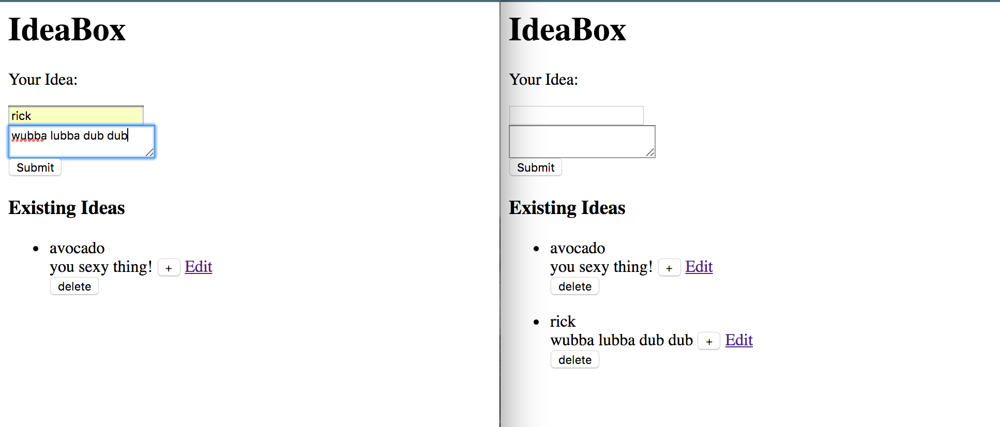
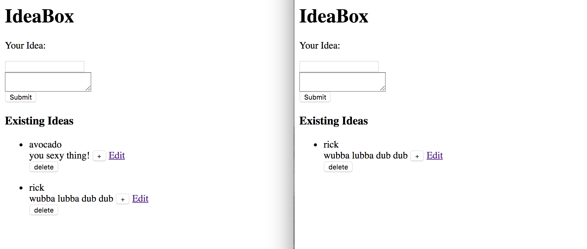
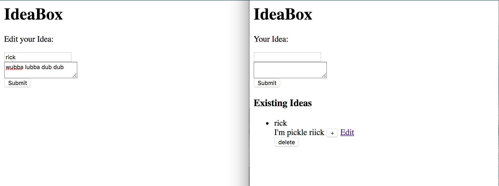
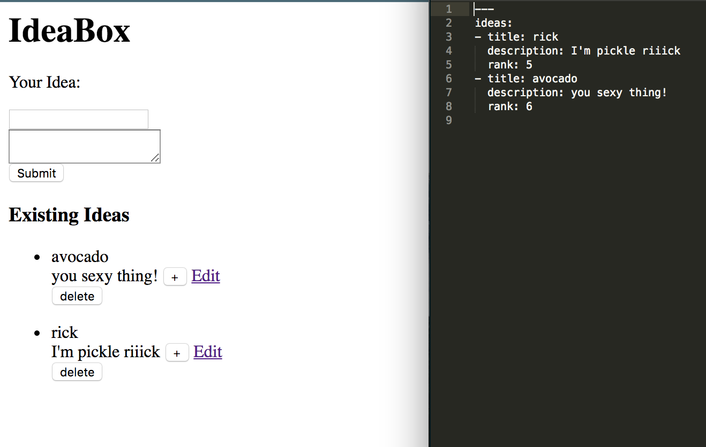
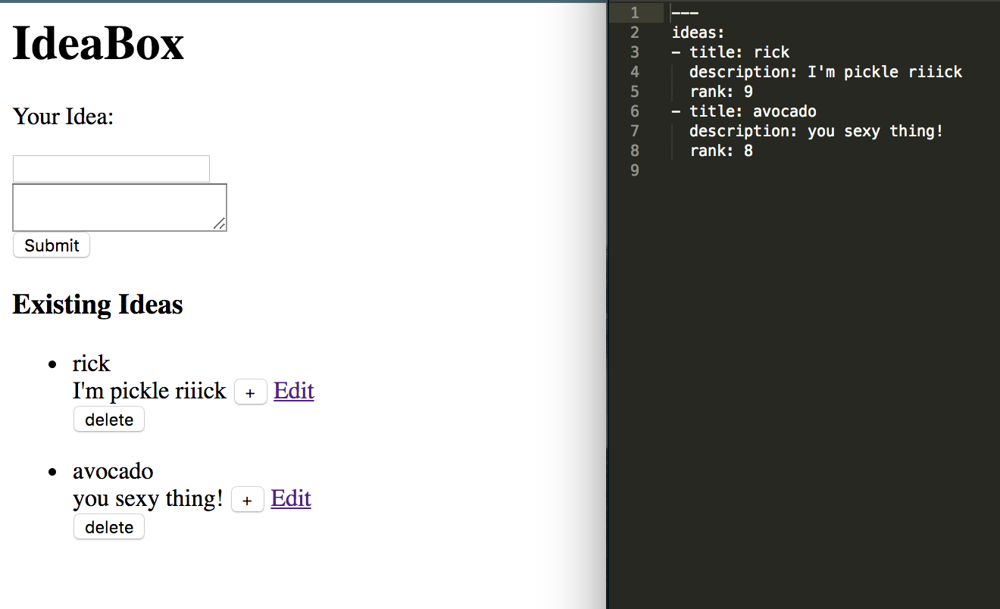

I followed the IdeaBox project from [here]. (http://tutorials.jumpstartlab.com/projects/idea_box.html#ideabox). Used Sinatra framework. Haven't go through the extentions.

# 1. Creating Ideas

# 2. Deleting_ideas

# 3. Editing_ideas

# 4. Ranking_and_sorting

